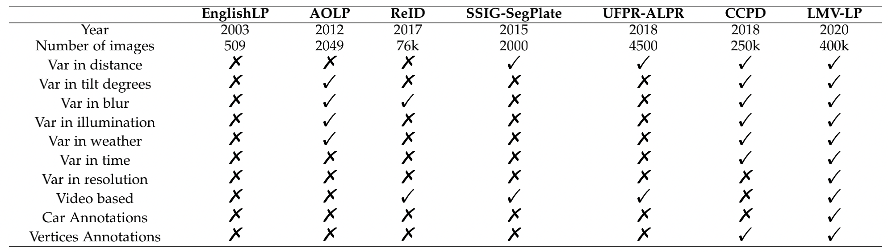
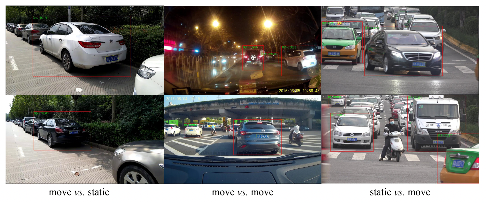

# LSV-LP

## Download
#### It can be downloaded from:
* [BaiduYun Drive](https://pan.baidu.com/s/183T4m0m8ytIruN0djLmp5A) password:fp52
#### For the other download links would be released soon.

## Structure
```
LSV-LP
├── test
│   ├── jsons
│   │   ├── move2move
│   │   │   ├── 1
│   │   │   │   ├── frame1.json
│   │   │   │   ├── ...
│   │   ├── move2static
│   │   └── static2move
│   └── videos
│       ├── move2move
│       │   ├── 1
│       │   │   ├── frame1.jpg
│       │   │   ├── ...
│       ├── move2static
│       └── static2move
├── train
│   ├── jsons
│   │   ├── move2move
│   │   ├── move2static
│   │   └── static2move
│   └── videos
│       ├── move2move
│       ├── move2static
│       └── static2move
└── validation
    ├── jsons
    │   ├── move2move
    │   ├── move2static
    │   └── static2move
    └── videos
        ├── move2move
        ├── move2static
        └── static2move
```

## Annotation

* 'id': the id of the car and its plate in this video;
* 'carBox': the bounding box of the car in this frame;
* 'licPoly': the coordinates of the four vertices of the current license plate;
* 'licNumber': the number of the current license plate;

## Compare


## Samples
* [Google Drive](https://drive.google.com/file/d/1udqRddpJZMpTdHHQdwZRll6vaYALUiql/view?usp=sharing)

## Demo


## Label Toolkit
* [LP_Labler](https://github.com/Elin24/license_labeler)
  
## Acknowledgement
Please cite the paper _《Q. Wang, X. Lu, C. Zhang, Y. Yuan and X. Li, "LSV-LP:Large-Scale Video-Based License Plate Detection and Recognition," IEEE Transactions on Pattern Analysis and Machine Intelligence (T-PAMI), 2022》_, if you benefit from this dataset.


## Limitation of Liability
It is worth noting that LSV-LP can only be used for academic research, not for commercial use.
